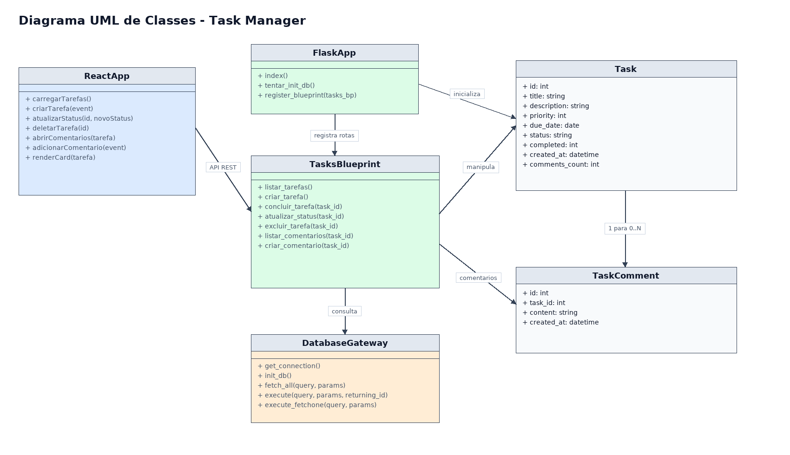
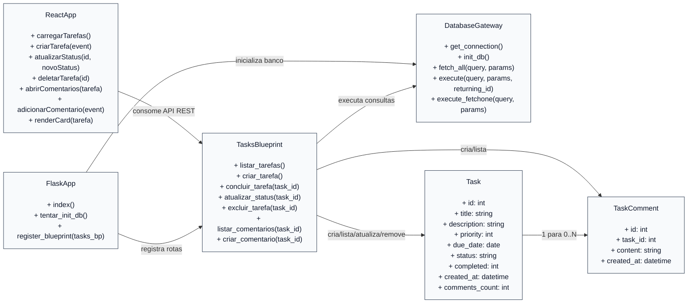

# Diagrama UML de Classes - Task Manager

```mermaid
flowchart LR
    ReactApp["ReactApp<br/><br/>+ carregarTarefas()<br/>+ criarTarefa(event)<br/>+ atualizarStatus(id, novoStatus)<br/>+ deletarTarefa(id)<br/>+ abrirComentarios(tarefa)<br/>+ adicionarComentario(event)<br/>+ renderCard(tarefa)"]

    FlaskApp["FlaskApp<br/><br/>+ index()<br/>+ tentar_init_db()<br/>+ register_blueprint(tasks_bp)"]

    TasksBlueprint["TasksBlueprint<br/><br/>+ listar_tarefas()<br/>+ criar_tarefa()<br/>+ concluir_tarefa(task_id)<br/>+ atualizar_status(task_id)<br/>+ excluir_tarefa(task_id)<br/>+ listar_comentarios(task_id)<br/>+ criar_comentario(task_id)"]

    DatabaseGateway["DatabaseGateway<br/><br/>+ get_connection()<br/>+ init_db()<br/>+ fetch_all(query, params)<br/>+ execute(query, params, returning_id)<br/>+ execute_fetchone(query, params)"]

    Task["Task<br/><br/>+ id: int<br/>+ title: string<br/>+ description: string<br/>+ priority: int<br/>+ due_date: date<br/>+ status: string<br/>+ completed: int<br/>+ created_at: datetime<br/>+ comments_count: int"]

    TaskComment["TaskComment<br/><br/>+ id: int<br/>+ task_id: int<br/>+ content: string<br/>+ created_at: datetime"]

    ReactApp -->|consome API REST| TasksBlueprint
    FlaskApp -->|registra rotas| TasksBlueprint
    FlaskApp -->|inicializa banco| DatabaseGateway
    TasksBlueprint -->|executa consultas| DatabaseGateway
    TasksBlueprint -->|cria/lista/atualiza/remove| Task
    TasksBlueprint -->|cria/lista| TaskComment
    Task -->|1 para 0..N| TaskComment

    classDef classe fill:#f8fafc,stroke:#334155,stroke-width:1px,color:#0f172a;
    class ReactApp,FlaskApp,TasksBlueprint,DatabaseGateway,Task,TaskComment classe;
```
