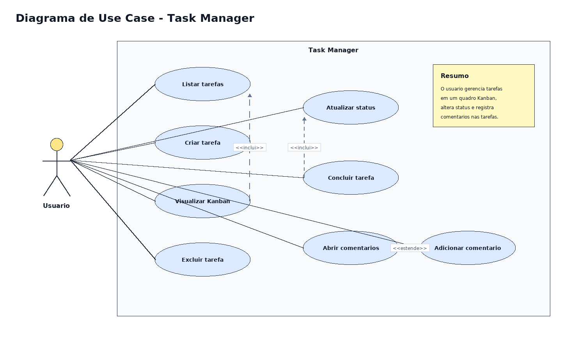
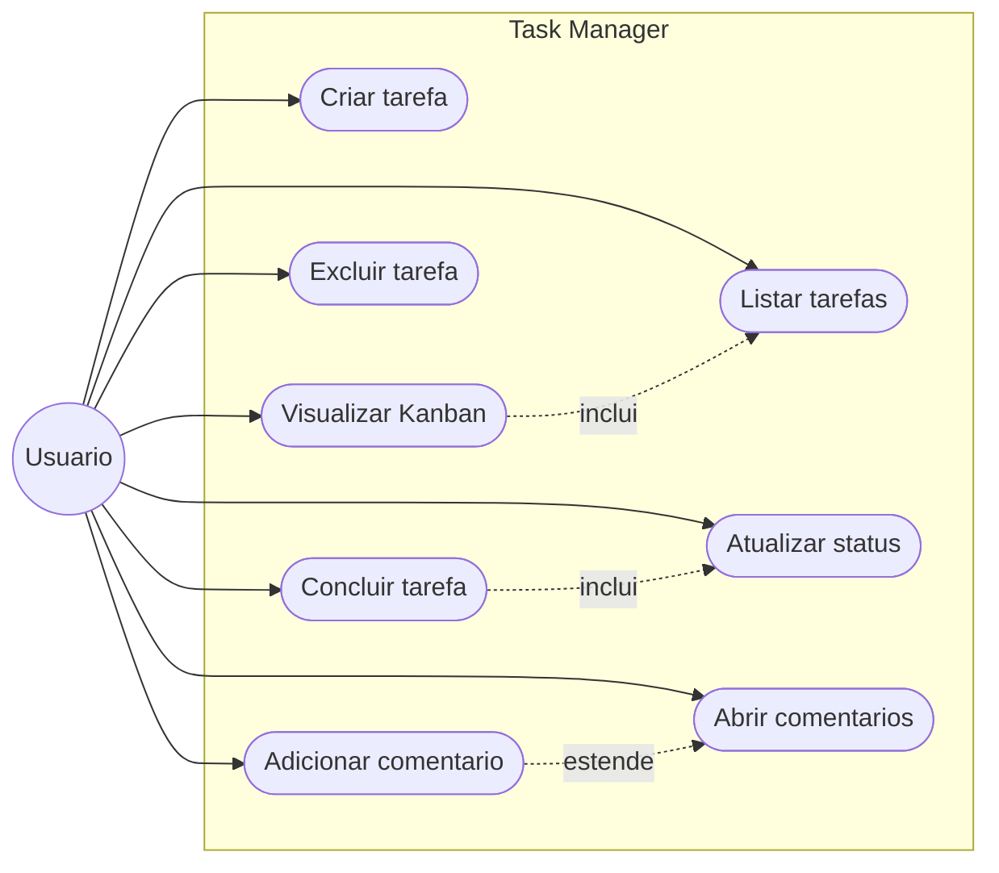

# Diagrama de Use Case - Task Manager

```mermaid
flowchart LR
    Usuario((Usuario))

    subgraph Sistema["Task Manager"]
        Listar([Listar tarefas])
        Criar([Criar tarefa])
        Atualizar([Atualizar status])
        Concluir([Concluir tarefa])
        Excluir([Excluir tarefa])
        AbrirComentarios([Abrir comentarios])
        AdicionarComentario([Adicionar comentario])
        VisualizarKanban([Visualizar Kanban])
    end

    Usuario --> Listar
    Usuario --> Criar
    Usuario --> Atualizar
    Usuario --> Concluir
    Usuario --> Excluir
    Usuario --> AbrirComentarios
    Usuario --> AdicionarComentario
    Usuario --> VisualizarKanban

    Concluir -. inclui .-> Atualizar
    AdicionarComentario -. estende .-> AbrirComentarios
    VisualizarKanban -. inclui .-> Listar
```
