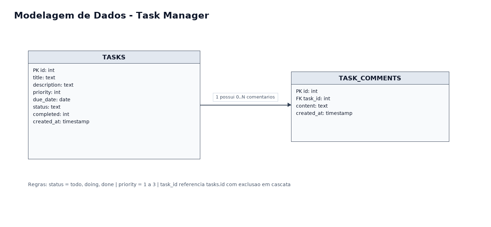
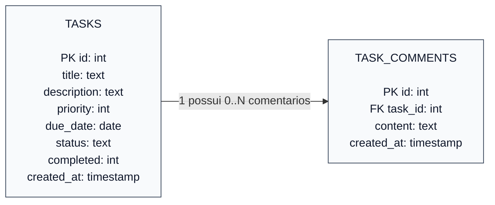

# Modelagem de Dados - Task Manager

## Regras dos Dados

- `TASKS.status` aceita os valores `todo`, `doing` e `done`.
- `TASKS.priority` usa valores de `1` a `3`.
- `TASK_COMMENTS.task_id` referencia `TASKS.id` com exclusao em cascata.
